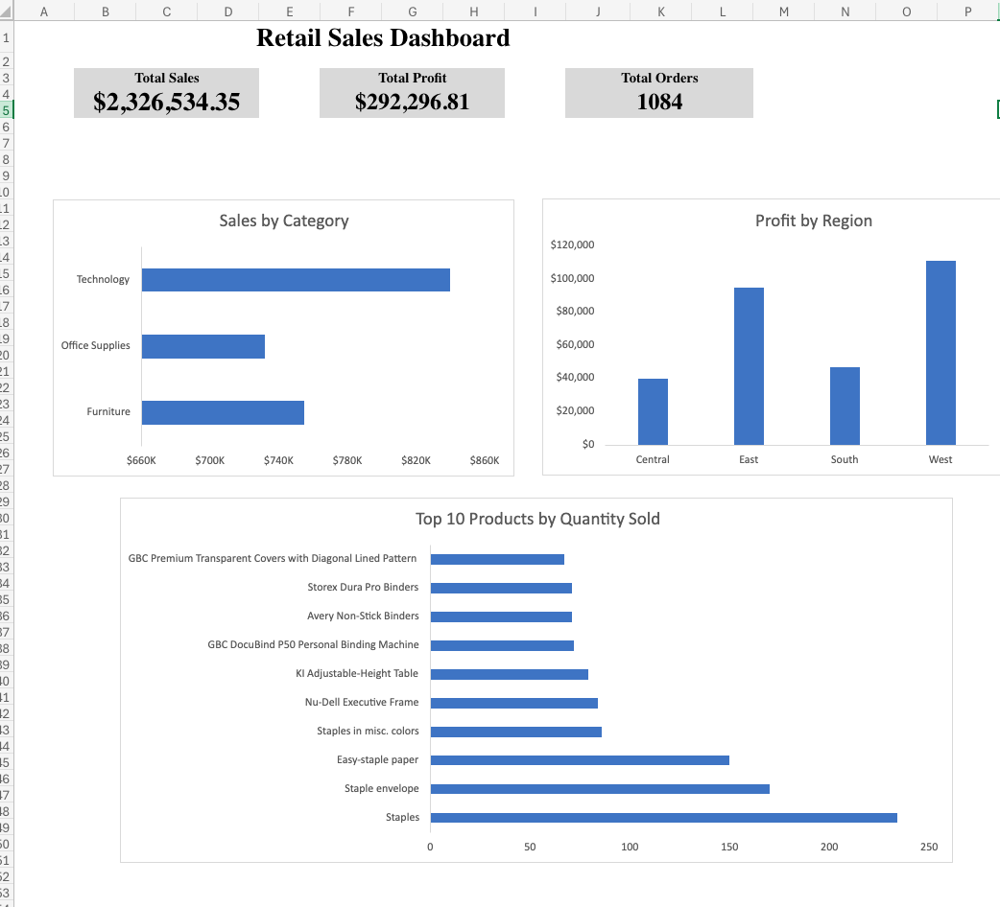

# Retail Sales Executive Dashboard

## Project Overview

This project showcases an interactive executive sales dashboard built in Microsoft Excel using the Sample Superstore dataset. The dashboard summarizes key business performance metrics through KPI cards and Pivot Chart visualizations, allowing stakeholders to quickly assess overall sales performance.

---

## Dashboard Preview

---

## Tools Used

- Microsoft Excel
- Pivot Tables
- Pivot Charts
- KPI Cards
- Dashboard Design

---

## Key Performance Indicators (KPIs)

- **Total Sales:** $2,326,534
- **Total Profit:** $292,297
- **Total Orders:** 1,084

---

## Dashboard Visualizations

- Sales by Category
- Profit by Region
- Top 10 Products by Quantity Sold

---

## Business Insights

- Technology generated the highest total sales.
- The West region produced the highest overall profit.
- Staples was the most frequently ordered product.
- The dashboard provides a concise executive-level summary of overall retail performance.

---

## Skills Demonstrated

- Data aggregation using Pivot Tables
- Executive dashboard design
- KPI development
- Data visualization
- Business reporting
- Excel analytics

---

## Dataset

Sample Superstore Dataset (included in this repository)
